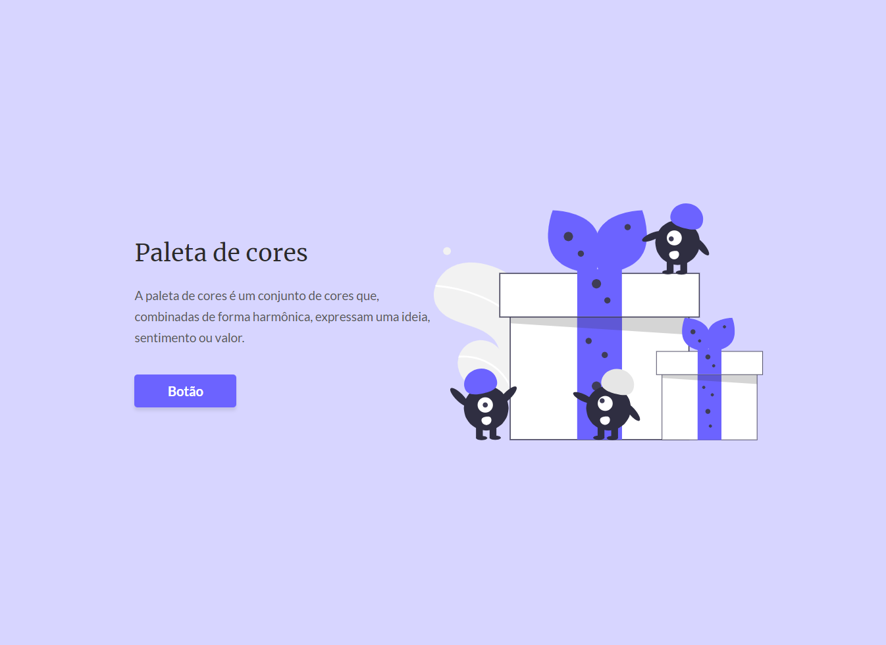
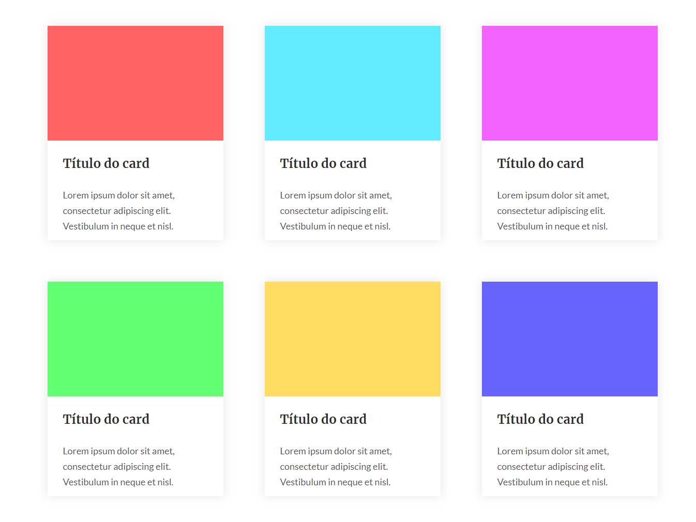
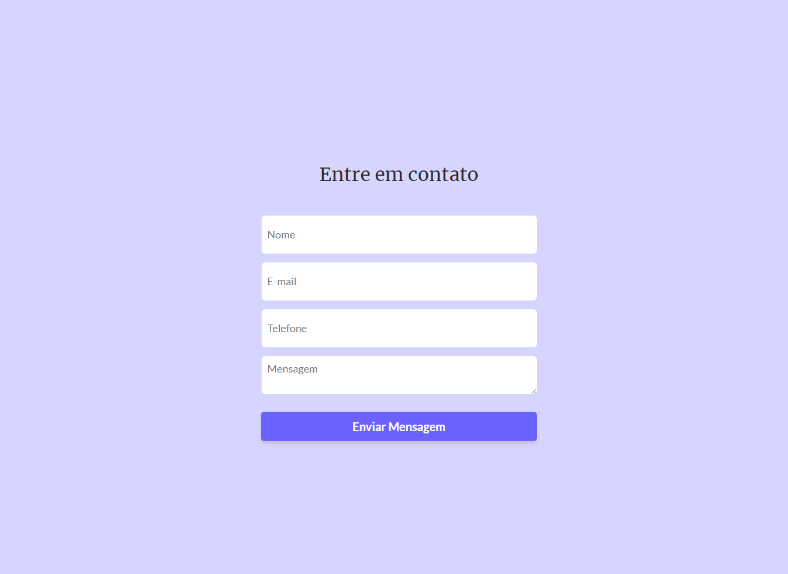

## 💻 Projeto

Esse projeto é uma landing page para gerar cores.

## 🚀 Tecnologias

- [HTML](https://developer.mozilla.org/pt-BR/docs/Web/HTML)
- [SASS](https://sass-lang.com)

## 📝 Critérios de aceite

- [ ] Criar as seguintes seções: Pagina principal, Pagina com opções de cores (Unsando Display: Grid), Pagina para contato.

  
</img>

  

  
</img>
